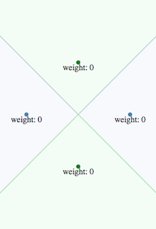

# d3-weighted-voronoi

This d3 plugin produces a _weighted Voronoi diagram_. It tessellates/partitions the plane given a set of weighted two-dimensional sites.

Because a picture is worth a thousand words:

 <== default / weighted ==> 

Available only for **d3 v4**, **d3 v5** and **d3 v6**.

This plugin is at the root of:

- the [d3-voronoi-map](https://github.com/Kcnarf/d3-voronoi-map) plugin, which computes a one-level Voronoï-based treemaps
- the [d3-voronoi-treemap](https://github.com/Kcnarf/d3-voronoi-treemap) plugin, which computes a multi-level Voronoï-based treemaps,
- the [d3-voronoi-map-tween](https://github.com/Kcnarf/d3-voronoi-map-tween) plugin, which allows animation between two d3-voronoi-map.

## Context

Compared to the _default_ Voronoï diagram, it adds the capability to assign a particular weight to each site. The higher is the weight of a site, the more this site influences its environment, and the larger is its surrounding area.

Weighted Voronoï diagrams come in severall flavours (additive/multiplicative, powered/not-powered, 2D/3D and higher dimensions, ..., cf. [Wikipedia](https://en.wikipedia.org/wiki/Weighted_Voronoi_diagram)). This plugin focuses on the **2D additive weighted power diagram**, which provides a tessellation made of convex hole-free polygons/cells with straight borders, as the default Voronoï diagram does.

Nonetheless, weighted Voronoï diagrams may have weird properties compared to _default_ Voronoï diagrams:

- a site may be outside it's zone of influence (ie. computed polygon)
- a site may have no zone of influence

These situations arise when some sites are overweighted by others. You can experiment it in [Voronoï playground : interactive weighted Voronoï study](http://bl.ocks.org/Kcnarf/dacd1d9d2f0e69cf93c68ecf32f7896d).

## Examples

- [Voronoï playground : interactive Voronoï transitioning thanks to weighted Voronoï](http://bl.ocks.org/Kcnarf/7d7f60ef86a77851c38c51904f4c8d39)

## Installing

If you use NPM, `npm install d3-weighted-voronoi`. Otherwise, load `https://rawcdn.githack.com/Kcnarf/d3-weighted-voronoi/v1.1.3/build/d3-weighted-voronoi.js` (or its `d3-weighted-voronoi.min.js` version) to make it available in AMD, CommonJS, or vanilla environments. In vanilla, a d3 global is exported:

```html
<script src="https://d3js.org/d3.v6.min.js"></script>
<script src="https://rawcdn.githack.com/Kcnarf/d3-weighted-voronoi/v1.1.3/build/d3-weighted-voronoi.js"></script>
<script>
  var weightedVoronoi = d3.weightedVoronoi();
</script>
```

If you're interested in the latest developments, you can use the master build, available throught:

```html
<script src="https://raw.githack.com/Kcnarf/d3-weighted-voronoi/master/build/d3-weighted-voronoi.js"></script>
```

## TL;DR;

In your javascript, in order to define the tessellation:

```javascript
var weightedVoronoi = d3.weightedVoronoi()
  .x(function(d){ return xScale(d); }                     // set the x coordinate accessor
  .y(function(d){ return yScale(d); }                     // set the y coordinate accessor
  .weight(function(d){ return weightScale(d); }           // set the weight accessor
  .clip([[0,0], [0,height], [width, height], [width,0]])  // set the clipping polygon

var cells = weightedVoronoi(data);                        // compute the weighted Voronoi tessellation
```

Then, later in your javascript, in order to draw cells:

```javascript
d3.selectAll('path')
  .data(cells)
  .enter()
  .append('path')
  .attr('d', function (d) {
    return cellLiner(d) + 'z';
  });
```

## Reference

- [Computing Voronoi Treemaps - Faster, Simpler, and Resolution-independent ](https://www.uni-konstanz.de/mmsp/pubsys/publishedFiles/NoBr12a.pdf), section 4.4
- (part of) [https://github.com/ArlindNocaj/power-voronoi-diagram](https://github.com/ArlindNocaj/power-voronoi-diagram) for a Java implementation

## API

<a name="weightedVoronoi" href="#weightedVoronoi">#</a> d3.<b>weightedVoronoi</b>()

Creates a new weightedVoronoi with the default [_x_-](#weightedVoronoi_x), [_y_-](#weightedVoronoi_y), [_weight_-](#weightedVoronoi_weight) accessors, and [_clip_](#weightedVoronoi_clip), [_extent_](#weightedVoronoi_extent), [_size_](#weightedVoronoi_size) configuration values.

<a name="_weightedVoronoi" href="#_weightedVoronoi">#</a> <i>weightedVoronoi</i>(<i>data</i>)

Computes the **weighted Voronoi diagram** for the specified _data_ points.

Returns a sparse array of polygons clipped to the [_clip_](#weightedVoronoi_clip) polygon, one for each cell (each unique input point) in the diagram. Each polygon is represented as an array of points \[_x_, _y_\] where _x_ and _y_ are the point coordinates, a _site_ field that refers to its site (ie. with x, y and weight retrieved from the original data), and a _site.originalObject_ field that refers to the corresponding element in _data_. Polygons are open: they do not contain a closing point that duplicates the first point; a triangle, for example, is an array of three points. Polygons are also counterclockwise (assuming the origin ⟨0,0⟩ is in the top-left corner).

Note that weighted Voronoï diagrams may have weird properties compared to _default_ Voronoï diagrams:

- a site may be outside it's zone of influence (ie. computed polygon)
- a site may have no zone of influence

These situations arise when some sites are overweighted by others. You can experiment it in [Voronoï playground : interactive weighted Voronoï study](http://bl.ocks.org/Kcnarf/dacd1d9d2f0e69cf93c68ecf32f7896d).

<a name="weightedVoronoi_x" href="#weightedVoronoi_x">#</a> <i>weightedVoronoi</i>.<b>x</b>([<i>x</i>])

If _x_ is specified, sets the _x_-coordinate accessor. If _x_ is not specified, returns the current _x_-coordinate accessor, which defaults to:

```js
function x(d) {
  return d.x;
}
```

<a name="weightedVoronoi_y" href="#weightedVoronoi_y">#</a> <i>weightedVoronoi</i>.<b>y</b>([<i>y</i>])

If _y_ is specified, sets the _y_-coordinate accessor. If _y_ is not specified, returns the current _y_-coordinate accessor, which defaults to:

```js
function y(d) {
  return d.y;
}
```

<a name="weightedVoronoi_weight" href="#weightedVoronoi_weight">#</a> <i>weightedVoronoi</i>.<b>weight</b>([<i>weight</i>])

If _weight_ is specified, sets the _weight_ accessor. If _weight_ is not specified, returns the current _weight_ accessor, which defaults to:

```js
function weight(d) {
  return d.weight;
}
```

<a name="weightedVoronoi_clip" href="#weightedVoronoi_clip">#</a> <i>weightedVoronoi</i>.<b>clip</b>([<i>clip</i>])

If _clip_ is specified, sets the clipping polygon, compute the adequate [_extent_](#weightedVoronoi_extent) and [_size_](#weightedVoronoi_size), and returns this layout. _clip_ must define a hole-free concave polygon, and must be specified as an array of 2D points \[x, y\], which must be _(i)_ open (no duplication of the first D2 point) and _(ii)_ counterclockwise (assuming the origin ⟨0,0⟩ is in the top-left corner). If _clip_ is not specified, returns the current clipping polygon, which defaults to:

```js
[
  [0, 0],
  [0, 1],
  [1, 1],
  [1, 0],
];
```

<a name="weightedVoronoi_extent" href="#weightedVoronoi_extent">#</a> <i>weightedVoronoi</i>.<b>extent</b>([<i>extent</i>])

If _extent_ is specified, it is a convenient way to define the clipping polygon as a rectangle. It sets the extent, computes the adequate [_clip_](#weightedVoronoi_clip)ping polygon and [_size_](#weightedVoronoi_size), and returns this layout. _extent_ must be a two-element array of 2D points \[x, y\], which defines the clipping polygon as a rectangle with the top-left and bottom-right corners respectively set to the first and second points (assuming the origin ⟨0,0⟩ is in the top-left corner on the screen). If _extent_ is not specified, returns the current extent, which is `[[minX, minY], [maxX, maxY]]` of current clipping polygon, and which defaults to:

```js
[
  [0, 0],
  [1, 1],
];
```

<a name="weightedVoronoi_size" href="#weightedVoronoi_size">#</a> <i>weightedVoronoi</i>.<b>size</b>([<i>size</i>])

If _size_ is specified, it is a convenient way to define the clipping polygon as a rectangle. It sets the size, computes the adequate [_clip_](#weightedVoronoi_clip)ping polygon and [_extent_](#weightedVoronoi_extent), and returns this layout. _size_ must be a two-element array of numbers `[width, height]`, which defines the clipping polygon as a rectangle with the top-left corner set to `[0, 0]`and the bottom-right corner set to `[width, height]`(assuming the origin ⟨0,0⟩ is in the top-left corner on the screen). If _size_ is not specified, returns the current size, which is `[maxX-minX, maxY-minY]` of current clipping polygon, and which defaults to:

```js
[1, 1];
```

## Dependencies

- d3-array.extent
- d3-polygon.{polygonHull, polygonLenght}

## Semantic Versioning

d3-weighted-voronoi attempts to follow [semantic versioning](https://semver.org) and bump major version only when backwards incompatible changes are released.
