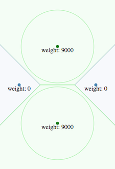

# d3-weighted-voronoi
This d3 plugin produces a *weighted Voronoi diagram*. It tessellates/partitions the plane given a set of weighted two-dimensional sites.

Because a picture is worth a thousand words:

 ==> 

Available only for **d3 v4**.

this plugin is one of the core feature of the [d3-voronoi-map](https://github.com/Kcnarf/d3-voronoi-map) and [d3-voronoi-treemap](https://github.com/Kcnarf/d3-voronoi-treemap) plugins, which computes respectively one-level and multi-level Voronoi-based treemaps.

## Context
Compared to the *default* Voronoï diagram, it adds the capability to assign a particular weight to each site. The higher is the weight of a site, the more this site influences its environment, and the larger is its surrounding area.

Weighted Voronoï diagrams come in severall flavours (additive/multiplicative, powered/not-powered, 2D/3D and higher dimensions, ..., cf. [Wikipedia](https://en.wikipedia.org/wiki/Weighted_Voronoi_diagram)). This plugin focuses on the **2D additive weighted power diagram**, which provides a tessellation made of concave hole-free polygons/cells with straight borders, as the default Voronoï diagram does.

Nonetheless, weighted Voronoï diagrams may have weird properties compared to *default* Voronoï diagrams:
 * a site may be outside it's zone of influence (ie. computed polygon) 
 * a site may have no zone of influence

 These situations arise when some sites are overweighted by others. You can experiment it in [Voronoï playground : interactive weighted Voronoï study](http://bl.ocks.org/Kcnarf/dacd1d9d2f0e69cf93c68ecf32f7896d).

## Examples
* [Voronoï playground : interactive Voronoï transitioning thanks to weighted Voronoï](http://bl.ocks.org/Kcnarf/7d7f60ef86a77851c38c51904f4c8d39)

## Installing
If you use NPM, ```npm install d3-weighted-voronoi```. Otherwise, load ```https://rawgit.com/Kcnarf/d3-weighted-voronoi/master/build/d3-weighted-voronoi.js``` (or its ```d3-weighted-voronoi.min.js``` version) to make it available in AMD, CommonJS, or vanilla environments. In vanilla, a d3 global is exported:
```html
<script src="https://d3js.org/d3.v4.min.js"></script>
<script src="https://raw.githack.com/Kcnarf/d3-weighted-voronoi/master/build/d3-weighted-voronoi.js"></script>
<script>
  var weightedVoronoi = d3.weightedVoronoi();
</script>
```

## TL;DR;
In your javascript, in order to define the tessellation:
```javascript
var weightedVoronoi = d3.weightedVoronoi()
  .x(function(d){ return xScale(d); }                   // set the x coordinate accessor
  .y(function(d){ return yScale(d); }                   // set the y coordinate accessor
  .weight(function(d){ return weightScale(d); }         // set the weight accessor
  .clip([0,0], [0,height], [width, height], [width,0])  // set the clipping polygon

var cells = weightedVoronoi(data);                      // compute the weighted Voronoi tessellation
  
```

Then, later in your javascript, in order to draw cells:
```javascript
d3.selectAll('path')
  .data(cells)
  .enter()
    .append('path')
      .attr('d', function(d){ return cellLiner(d)+"z"; })
```

## Reference
* [Computing Voronoi Treemaps - Faster, Simpler, and Resolution-independent ](https://www.uni-konstanz.de/mmsp/pubsys/publishedFiles/NoBr12a.pdf), section 4.4
* (part of) [https://github.com/ArlindNocaj/power-voronoi-diagram](https://github.com/ArlindNocaj/power-voronoi-diagram) for a Java implementation

## API
<a name="weightedVoronoi" href="#weightedVoronoi">#</a> d3.<b>weightedVoronoi</b>()

Creates a new weightedVoronoi with the default [*x*-](#weightedVoronoi_x), [*y*-](#weightedVoronoi_y), [*weight*-](#weightedVoronoi_weight) accessors, and [*clip*](#weightedVoronoi_clip) configuration value.

<a name="_weightedVoronoi" href="#_weightedVoronoi">#</a> <i>weightedVoronoi</i>(<i>data</i>)

Computes the **weighted Voronoi diagram** for the specified *data* points.

Returns a sparse array of polygons clipped to the [*clip*](#weightedVoronoi_clip) polygon, one for each cell (each unique input point) in the diagram. Each polygon is represented as an array of points \[*x*, *y*\] where *x* and *y* are the point coordinates, a *site* field that refers to its site (ie. with x, y and weight retrieved from the original data), and a *site.originalObject* field that refers to the corresponding element in *data*. Polygons are open: they do not contain a closing point that duplicates the first point; a triangle, for example, is an array of three points. Polygons are also counterclockwise (assuming the origin ⟨0,0⟩ is in the top-left corner).

Note that weighted Voronoï diagrams may have weird properties compared to *default* Voronoï diagrams:
 * a site may be outside it's zone of influence (ie. computed polygon) 
 * a site may have no zone of influence

 These situations arise when some sites are overweighted by others. You can experiment it in [Voronoï playground : interactive weighted Voronoï study](http://bl.ocks.org/Kcnarf/dacd1d9d2f0e69cf93c68ecf32f7896d).

<a name="weightedVoronoi_x" href="#weightedVoronoi_x">#</a> <i>weightedVoronoi</i>.<b>x</b>([<i>x</i>])

If *x* is specified, sets the *x*-coordinate accessor. If *x* is not specified, returns the current *x*-coordinate accessor, which defaults to:

```js
function x(d) {
  return d.x;
}
```

<a name="weightedVoronoi_y" href="#weightedVoronoi_y">#</a> <i>weightedVoronoi</i>.<b>y</b>([<i>y</i>])

If *y* is specified, sets the *y*-coordinate accessor. If *y* is not specified, returns the current *y*-coordinate accessor, which defaults to:

```js
function y(d) {
  return d.y;
}
```

<a name="weightedVoronoi_weight" href="#weightedVoronoi_weight">#</a> <i>weightedVoronoi</i>.<b>weight</b>([<i>weight</i>])

If *weight* is specified, sets the *weight* accessor. If *weight* is not specified, returns the current *weight* accessor, which defaults to:

```js
function weight(d) {
  return d.weight;
}
```

<a name="weightedVoronoi_clip" href="#weightedVoronoi_clip">#</a> <i>weightedVoronoi</i>.<b>clip</b>([<i>clip</i>])

If *clip* is specified, sets the clipping polygon. *clip* defines a hole-free concave polygon, and is specified as an array of 2D points \[x, y\], which must be *(i)* open (no duplication of the first D2 point) and *(ii)* counterclockwise (assuming the origin ⟨0,0⟩ is in the top-left corner). If *clip* is not specified, returns the current clipping polygon, which defaults to:

```js
[[0,0], [0,1], [1,1], [1,0]]
```

## Dependencies
 * d3-array.extent
 * d3-polygon.{polygonHull, polygonLenght}

## Testing
In order to test the code

```sh
git clone https://github.com/Kcnarf/d3-weighted-voronoi.git
[...]
yarn install
[...]
yarn test
```
